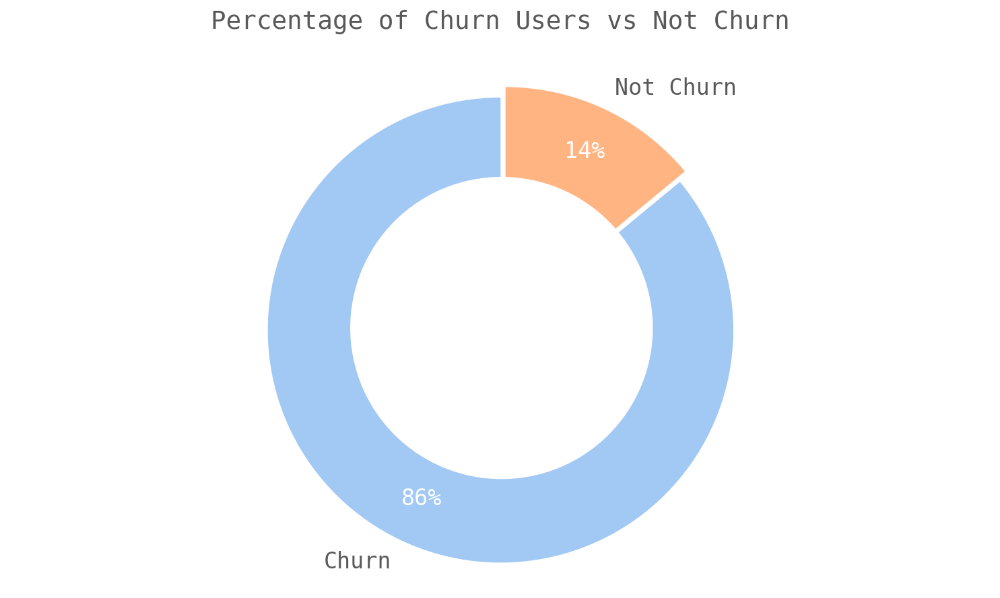
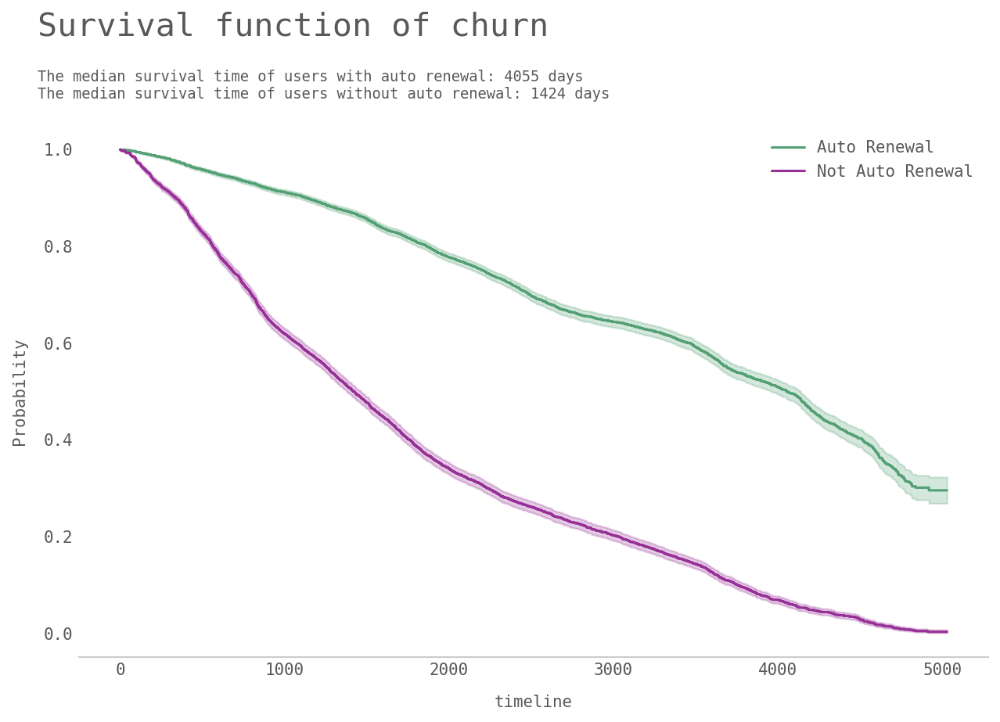
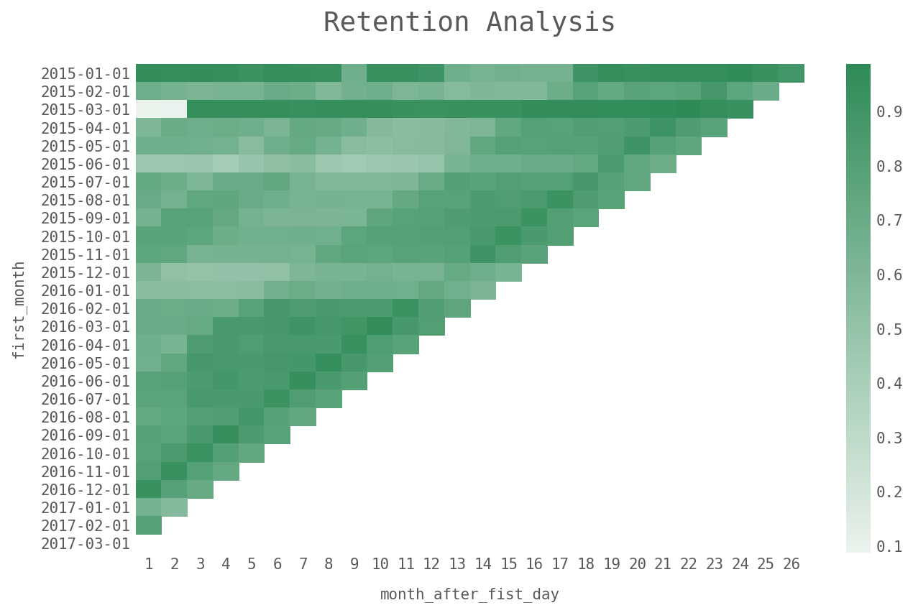

# Will they go or will they stay?
## User churn prediction and prevention of an online music streaming service

	
	

  <i>Photo by Mantas Hesthaven on Unsplash</i> 

### *Table of contents*
  * [Introduction](#Introduction) 
  * [Dataset](#Dataset)
  * [User churn prediction](#User-churn-prediction)
  * [Survival Analysis](#Survival-analysis)
  * [Customer Lifetime Value](#Customer-lifetime-value )
  * [Conclusion](#Conclusion)

## Introduction 
Building up and keeping a loyal customer can be challenging for any company, especially when customers are free to choose from various providers within a product category. Furthermore, retaining existing customers is generally more cost-effective than acquiring new ones. For this reason, evaluating user retention is crucial for business. It is essential to measure the level of customer satisfaction and measure the number of clients that will potentially stop the contract or make purchases with a company or service.

Customer churn, also known as customer attrition, is the percentage of customers that stopped using a company's service during a particular period. Keeping churn rates as low as possible is what every business pursuits. Identifying potential churners and influential features in advance allows the company to develop strategies to prevent customers from leaving. There are numerous ways a company can do to keep their customers. For example, offer incentives, like discounts or loyalty programs, provide additional services or engage with your user on social media in an attempt to reduce the churn rate. 

After identifying the potential churners, I will introduce the Survival Analysis and Customer Life Time Value Analysis. Why bother? It would be great to know every customer who will churn, but how much insight would that information really bring? And how would you know when and what to focus on if you wanted to keep them and how much you could spend to keep them before having them as a customer turned into a loss? Our churn prediction model provides no clear answer as to what time scale it is predicting for. And this is when Survival Analysis and Customer Life Time Value Analysis come into play. The former allows us to model the time to an event(churn). The latter gives us crucial insights into how much money we should be spending on acquiring the customers by calculating how much value they'll bring to the business in the long run. Rather than just racing to keep my head above water, I would like to understand which customers I should be focusing on and, more importantly, why I should be focusing on them. 

Compared with churn prediction, survival analysis is rarely known by people but an extremely helpful tool. I will spend more time going through all processes in this project. OK, Let's begin by looking into the dataset to predict the churn of KKBOX's paid users!

## Dataset
The data I will be using for this project is from KKBOX. KKBOX is Asia’s leading music streaming service, holding the world’s most comprehensive Asia-Pop music library with over 30 million tracks. They offer a generous, unlimited version of their service to millions of people, supported by advertising and paid subscriptions. After initial data processing and transforming, I have two data sets, user_sample_data and user_log_sample. The former contains 1,704,672 entires and 19 columns, and the latter contains 1,704,672 entires and 21 columns.

### user_sample_data
- msno: user id
- city: In total 21 cities and they are encoded by integers.
- bd: age
- gender
- registered_via: registration method
- registration_init_time: format %Y%m%d
- expiration_date: format %Y%m%d, taken as a snapshot at which the member.csv is extracted. Not representing the actual churn behavior.
- payment_method_id: payment method
- payment_plan_days: length of membership plan in days
- plan_list_price: in New Taiwan Dollar (NTD)
- actual_amount_paid: in New Taiwan Dollar (NTD)
- is_auto_renew
- transaction_date: format %Y%m%d
- membership_expire_date: format %Y%m%d
- is_cancel: whether or not the user canceled the membership in this transaction.

### user_log_sample
The original `user_log` data set is fairly large, and contains the following extra columns. For simplicity and efficiency, I will provide the `user_log_sample`, which has already been preprocessed and joined with the aggregated `user_sample_data`. I have included my data tweaking process in the notebook for your reference. 

- num_25: # of songs played less than 25% of the song length
- num_50: # of songs played between 25% to 50% of the song length
- num_75: # of songs played between 50% to 75% of of the song length
- num_985: # of songs played between 75% to 98.5% of the song length
- num_100: # of songs played over 98.5% of the song length
- num_unq: # of unique songs played
- total_secs: total seconds played
 
Note that the integer features num_25, num_50, num_75, num_985, and num_100 tell us the number of songs for this day that the user played for <25%, 25-50%, 50-75%, 75-98.5%, or >98.5% of their total duration.

## User churn prediction
In this section, my goal is to predict whether or not a customer will churn based on various features that I created previously. I will be using supervised machine learning techniques to make predictions. Before the modeling process, I also conducted a simple exploratory data analysis and feature engineering to create insightful new features. Notice that I won't dig too deep in terms of data exploration. I am doing the complete and extensive exploratory data analysis of this data on another project, which will be posted soon.

### Percentage of Churned Users vs Non-Churned Users

	
	

  <i>Figure 0.</i> 

### Feature engineering 
I create the following features:
- **Age_Range bucket(age_bin)**: I created buckets for the age-range 5-11(child), 12-18(teenagers), 19-25(college students), 26-35(newly grad and early career professionals), 36-45(mid-aged), 46-60, and 60-100.
- **days_to_first_trans**: The time between a user's registration and his or her first transaction with the company
- **days_between_trans**: The sum of time that a user was not in contract with the company during the observation period. Suppose there are five days after the termination/expiration of his first contract and before his second contract, and ten days after the termination/expiration of his third contract and before his fourth contract, the value of days_between_trans is then 15.  
- **tenure**: The number of days between the registration date and the membership expiration date, provided that this user had churned. If the user didn't churn, the tenure is then defined as the number of days between the registration date and the snapshot date.
- **no_records**: The number of records a user has in our data set, which, to some extent, represents how frequently a user is interacting with the company.
- **uniq_rate**: The ratio between the number of unique songs a user had listened to and the number of total songs he/she had listen to.
- **listening_type**: There are three types of listeners, loyalist_type, normal_type, and switcher_type. If the percentage of the number of songs a user played for >75% of their total duration over the number of all songs played is higher than 80%, the user is defined as a loyalist type of listener.
For more detailed information, please check out my jupyter notebook.

### Model results
For this project, I used four classification models. One simple linear classification model: Logistic Regression, and three non-linear tree-based models: Random Forest, Gradient Boosted tree, and Extreme Gradient Boosting tree. Here are the results:

	
	

  <i>Figure 1.</i> 

We see that XGBoost is the game winner, with Logistic Regression being the runner-up (much to my surprise). XGBoost has been proving its effectiveness on Data Science projects for a while, and, in this project, it provided the best results among the models. For that reason, XGBoost algorithm would be our choice for the churn prediction model. According to Chen and Guestrin, the most important advantage of XGBoost is its scalability, which makes the technique adaptable to all sorts of different problems. XGBoost is an optimized version of the gradient boosting algorithm in terms of speed, handling missing values, and avoiding overfitting. For those who are interested in knowing more about the modeling as well as feature selection process, please check out the code. I also tried using the resampling methods to deal with the imbalance classification problem and for better prediction, but the results turned out to be not that satisfactory.

### Interpretation

	
	

  <i>Figure 1-1.</i> 

First, we look a the impurity-based feature importances from the xgboost model. The higher the value, the more important the feature. A feature's importance is computed as the (normalized) total reduction of the criterion brought by that feature, which is also known as the Gini importance. We see that `tenure`, `avg_amount_paid`, `days_to_first_trans` etc. are listed in the top places. However, according to scikit learn documentation, the impurity-based feature importance has a potential problem of being computed on statistics derived from the training dataset: the importance can be high even for features that are not predictive of the target variable. Let's look at another metric to double-check our result.
 

	
	

  <i>Figure 1-2.</i> 

Well, it seems that we have a pretty similar result, which is excellent. For those who are not familiar with permutation feature importance, the permutation feature importance is defined to be the decrease in a model score when a single feature value is randomly shuffled. This procedure breaks the relationship between the feature and the target, thus the drop in the model score is indicative of how much the model depends on the feature. This method can be misleading when we have highly correlated features. Since most of our features are not highly correlated, with the exception of the average number of songs played and the average number of seconds played, this is not so much of a problem. To best interpret the result, let's now see the marginal effect one feature has on the predicted outcome.

 

	
	

  <i>Figure 1-3.</i> 

Partial dependence plots (PDP) show the dependence between the target variable and a set of features of interest, marginalizing over the values of all other features (the complement features). PDP can also show the type of relationship, such as a step function, curvilinear, linear, etc. Figure 1-3 shows that the longer the tenure, the lower the probability that a user will churn. This trend goes up to roughly 3000 days, then slightly flattens after that point. For those who have a longer time before making his or her first transaction, the model predicts on average a high probability of churn. It comes with no surprise that the user who has the auto-renewal service activated has a lower chance of churning.
 
 

Interestingly, the predicted probability of churning remains fairly flat up to the average payment of 150 NTD and goes up after that. Further examination reveals that 150 NTD is the monthly price for those willing to activate the auto-renewal service. Bearing this information in mind, I would say the result then makes much sense to me. The partial dependence function at a particular feature value represents the average prediction if we force all data points to assume that feature value. The main advantage is that laypeople usually understand the idea of PDPs quickly. Note that the assumption of independence is the biggest issue with PDP. It is assumed that the feature for which the partial dependence is computed is not correlated with other features. As I have mentioned in the previous section, most of the features in our data are not correlated and, therefore, we don't need to worry too much about this issue for now.
 

## Survival Analysis 
Why do we need this? In customer relation management, however, we are often concerned with censored data. That is, the customer journeys end at the current point in time just because we cannot see what happens in the future. This is a kind of missing data that our previous models cannot handle. And this is where survival analysis comes into play. Survival analysis is suited for situations where for some observations an event has not yet happened, but may happen at some point in time (In this case, whether a user will churn). Survival analysis allows us to model the time to an event, also called failure or survival time. This avoids a loss of information due to aggregation. In the end, survival analysis allows us to obtain deep insights into customer relations since it is possible to model when an event will take place and not just if it will take place. If we predict that a certain customer is likely to end her contract within the next three months, special actions can be taken to keep her from churning. Survival Analysis is a set of methods used in the life sciences (mostly Epidemiology and Pharma research) to determine the probability of patient cohort survival over time. It’s a very large body of work with a great many intricate and statistically sophisticated tools, but I will only be using two of them — the Kaplan–Meier Estimator and the Cox Proportional Hazards Model.

### Survival function
The measure of interest in a survival analysis is the survival function. This function gives the probability that a customer will not churn in the period leading up to the time point t. To estimate the survival function, we will use the Kaplan-Meier Estimate in this project. It’s basically counting how many people has churn/not churned at each time point. For more information about this non-parametric method, please check [here](https://en.wikipedia.org/wiki/Kaplan%E2%80%93Meier_estimator).
Also we would need to bring up the concept of censored data. Censoring is a special case of missing data. The kind of censoring we are concerned with most often is random type I right-censoring. This means that a subject's event can only be observed if it occurs before a certain point in time. In the case of churn prediction, churn must happen before the current point in time to be observed. If it hasn't happened yet, we cannot know whether a person is going to churn in the future. We do, however, know that, for the time under consideration, a person has not yet churned. This is more information than completely missing data. Since customers enter our database at different points in time, censoring times can vary between subjects.

	
	

  <i>Figure 2.</i> 

The median survival time is 2623, that is, about 50 percent of the users do not churn before they reach a tenure duration of 2623 days. The median survival time is the time where a horizontal line at 0.5 intersects the survival curve. The counterpart to the survival function is the cumulative hazard function. It describes the cumulative risk, or the probability that the customer will have churned, up until time t.

	
	

  <i>Figure 3.</i> 

Recall that we are estimating cumulative hazard functions, thus we know the rate of change of this curve is an estimate of the hazard function. The hazard rate, also called force of mortality or instantaneous event rate, describes the risk that an event will occur in a small interval around time t, given that the event has not yet happened. Since the true form of the survival function is rarely known, a part of survival analysis is concerned with its estimation. Additionally, the sum of estimates is much more stable than the point-wise estimates.

	
	

  <i>Figure 4.</i> 

We have two survival curves , one for each cohort. From the curves, it is evident that the users, who have activated the auto renewal service, have better retention as compared to the users who have not activated the service. At any point t across the timeline, the survival probability of the cohort in purple is less than the cohort in green. For the cohort in purple, the survival probability is decreasing with high rate between 500-1000 days after registration and it gets relatively better after that; however, for the green cohort, the rate of decrease in survival rate is fairly constant and flat. Therefore, for the cohort , which has not activated the auto renewal service, efforts should be made to retain the users in their first 500-1000 days. Here the difference between survival functions is very obvious, and performing a statistical test seems pedantic. If the curves are more similar, or we possess less data, we may be interested in performing a statistical test. We can do more such cohort analysis from the survival curves of the different cohorts, say gender.

	
	

  <i>Figure 5.</i> 

This cohort analysis represents the limited use case of the potential of the survival analysis because we are using it for the aggregated level of the data. In order to check the effect of multiple user characteristics on the risk of churn and create the survival curves for even the individual users, we will leverage the power of Cox proportional hazards model. The idea behind Cox proportional hazard model is that the log-hazard of an individual is a linear function of their covariates and a population-level baseline hazard that changes over time.

### Cox Proportional Hazards Model

	
	

  <i>Figure 6.</i> 

In a cox proportional hazards model, coefficients are interpreted similar to a logistic regression. From the untransformed coefficient we can only draw conclusions about the direction of the effect. Looking at the coefficient for `is_auto_renew` I see that the risk of churning is lower for those who activate auto renewal service to those who don't. By transforming them using the exponential function, interpretation gets easier. Luckily, the model's summary already does the dirty work for us. We can find the transformed coefficients at the `exp(coef)` column, which are called the hazard ratio. The hazard to churn decreases by roughly 75 percent for users who activate auto renewal service to those who don't. For continuous covariates, interpretation changes slightly. For example, A one-unit increase in `uniq_rate` (a ratio of unique songs and all songs that a user has listened to) increases the hazard of churning by a factor of one point two five.

	
	

  <i>Figure 7.</i> 

It's clear that users that enjoy the whole songs(or at least 50%) without skipping the song are more likely to stick around. Well, it makes sense to me that users keeping switching the songs without actually listening them have worse retention. We can compare whether the churn generation process of the two populations are equal bu using `logrank_test`. According to the document, the logrank test statistic is calculated from the differences between the observed churns for a group and expected churns, under the null hypothesis that all groups share the same survival curve, summed across all ordered churns times. Here we have a p-value smaller than 0.01, which is statistically significant.

	
	

  <i>Figure 8.</i> 

As expected, users that are more active and more transactions have better retention. What's more, we can create the survival curves for the individual users to help the further personized marketing strategy development.

	
	

  <i>Figure 9.</i> 

 

	
	

  <i>Figure 10.</i> 

## Customer Lifetime Value 
Customer Lifetime Value (CLV) calculation is defined as the amount of profit associated with a customer over a period of time (Gupta et al. 2006). CLV helps you predict future revenue and measure long-term business success. More to the point, CLV helps you estimate how much you should invest in order to retain a customer. Knowing the lifetime value of a customer allows you to answer the question such as What amount of money can you afford to spend on the marketing campaigns. There are several ways to measure customer lifetime value, and the choice depends on your resources and your business. For simplicity, I select two simple-to-implement methods in this project.

#### Historical CLV
I first compute the historical CLV, which sums revenue of all past transactions of a user and multiply by profit margin. In this project we don't have data regarding profit margin and will hence ignore this element. However, this approach doesn't consider changes in user behavior. So if users change their interests and the way they purchase, it will affect the outcome. 

#### Traditional CLV
CLV = Average Revenue * Monthly Retention Rate / Monthly Churn Rate  
Using this CLV formula, we can take into account all possible changes of revenue during a specific period of time. In this project, I do this by creating monthly cohorts and their retention rate. Note that I didn't include the user acquisition cost and the discount rate for simplicity. We should do so if we have those data at hand. In this project, I derived the retention rate by performing a cohort analysis by acquisition date, which is shown in the following graph.

	
	

  <i>Figure 11.</i> 

## Conclusion
In this project, I start off performing churn prediction with several machine learning models, proceed with the survival analysis and finish the project with customer lifetime value calculation. By leveraging the insights drawn from these analyses, we are able to come up with more accurate user targeting strategies. From the churn prediction process, we know what kind of users are more likely to churn by investigating each feature's effect on churning. By performing survival analysis, we obtain deep insights into customer relations since it is possible to model when a churn event will take place and not just if it will take place. Lastly, customer lifetime value gives us a clear look at the benefit of acquiring and keeping any given customer. Not all customers are created equal. In fact, the top 1% of e-commerce customers are worth up to 18 times more than average customers. For simplicity, I didn't consider the cost of acquisition(COC), which is extremely important when it comes to calculating a precise CLV. Trying to manage customer churn is no easy task. However, we can still uncover a good number of insights that allow us to drive strategies and make informed decisions based on data. These insights will enable us to understand our users when it comes to churning and building alert systems and campaigns. There is still lots of work needed to be done to make this project more reliable and complete. In the future, I will try to interpret the model results with other model-agnostic methods, such as explaining individual predictions of black-box machine learning with LIME. Also, I will try performing a customer segmentation based on part of the results in this project.
